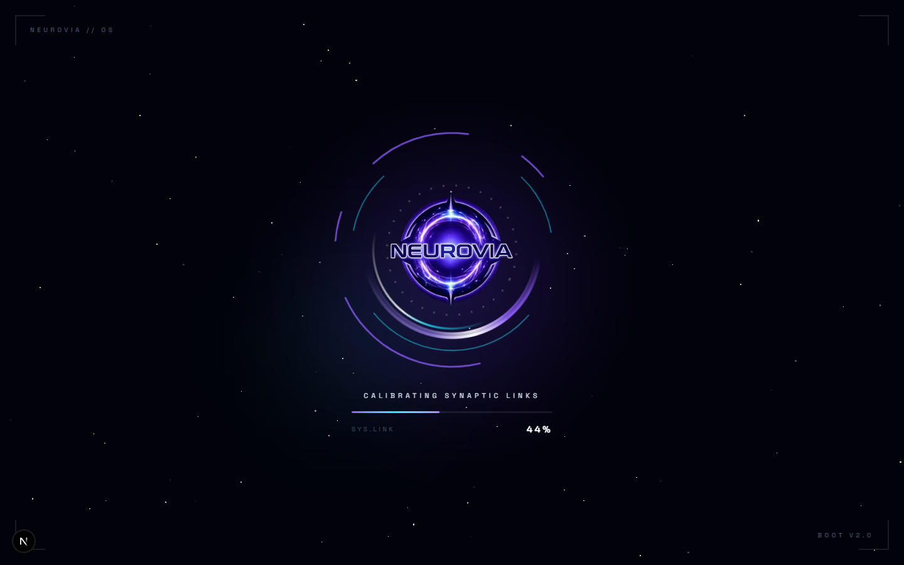
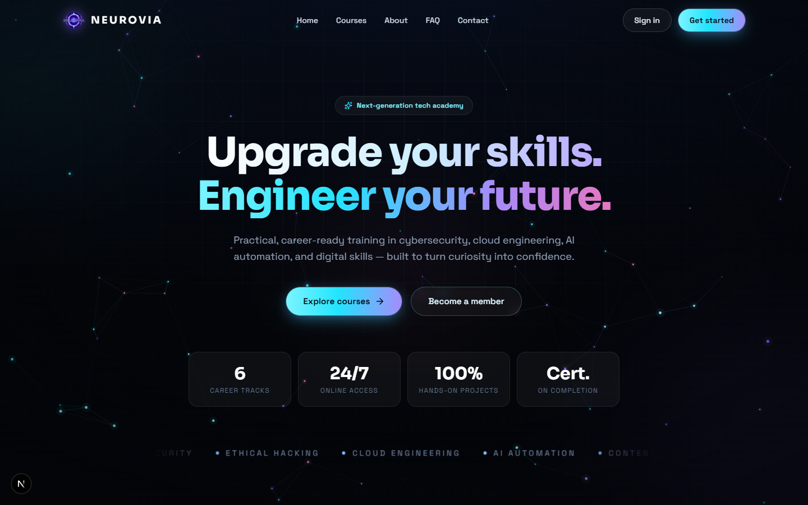
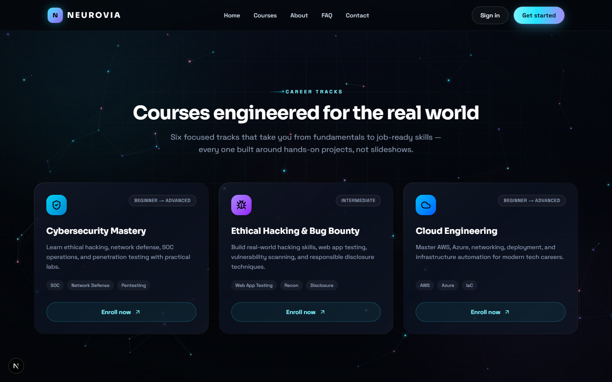

<div align="center">



<br/><br/>


<br/>

> `> INITIALIZING NEUROVIA... SYS.LINK ESTABLISHED ▊`
>
> **A future-focused learning platform** — practical, career-ready training in
> cybersecurity, cloud engineering, AI automation, and digital skills.

</div>



## ⚡ SYSTEM OVERVIEW

NEUROVIA turns curiosity into confidence and skills into career-ready results.
The interface is built like it means it: a neural-network particle field that
reacts to your cursor, a cinematic one-time boot sequence, and a glassmorphic
dark UI tuned for the next decade of tech.

<div align="center">
  
  
</div>

## 🧠 CORE MODULES

| MODULE | STATUS | DESCRIPTION |
| :-- | :--: | :-- |
| `BOOT.SEQUENCE` | 🟢 ONLINE | Sci-fi loading screen with orbital energy trails — plays **once per device** (Gmail-style, `localStorage`), then never again |
| `NEURAL.FIELD` | 🟢 ONLINE | Canvas particle network (~100 synapses) with cursor gravity — replaces a 37 MB video with a few KB of code |
| `CAREER.TRACKS` | 🟢 ONLINE | Six course tracks with gradient-glow cards, levels, and skill tags |
| `AUTH.INTERFACE` | 🟡 STANDBY | Sign in / create account modal — UI complete, backend uplink in phase two |
| `TESTIMONIALS + FAQ` | 🟢 ONLINE | Success stories and an animated accordion |
| `CONTACT.CHANNELS` | 🟢 ONLINE | Email, WhatsApp, Telegram, Instagram |

<div align="center">
  
</div>


## 🛰 TECH STACK

```
┌─ FRAMEWORK ──── Next.js 16 (App Router, Turbopack)
├─ LANGUAGE ───── TypeScript 5
├─ STYLING ────── Tailwind CSS v4 + custom design tokens
├─ MOTION ─────── Framer Motion 12 + hand-rolled canvas engine
├─ FONTS ──────── Sora (display) / Space Grotesk (body)
└─ BACKEND ────── Firebase (phase two)
```

## 🚀 BOOT SEQUENCE (Getting Started)

```bash
# 1. Clone the repo
git clone <your-repo-url>
cd neurovia-app

# 2. Install dependencies
npm install

# 3. Ignite
npm run dev
```

Open [http://localhost:3000](http://localhost:3000) — first visit triggers the
boot sequence. To replay it, clear the `neurovia-loader-seen` key from
localStorage (DevTools → Application → Local Storage).

## 📡 DEPLOYMENT // VERCEL

1. Push this repo to GitHub
2. Import it at [vercel.com/new](https://vercel.com/new) — Next.js is auto-detected
3. Deploy. No environment variables required for the front end

Social embeds (`og-image`), favicons, and `metadataBase` are pre-wired — the
production URL is picked up from Vercel automatically.

## 🗺 ROADMAP

- [x] **PHASE 1** — Front-end: design system, boot sequence, neural field, all sections
- [ ] **PHASE 2** — Firebase Auth wired to the auth interface
- [ ] **PHASE 3** — Firestore enrollments + learner dashboard
- [ ] **PHASE 4** — Payments & course delivery

## 📁 STRUCTURE

```
neurovia-app/
├── public/               # logo, favicons, og-image, readme assets
└── src/
    ├── app/              # layout (fonts/metadata), page, globals.css (tokens)
    ├── components/       # LoadingScreen, NeuralField, Navbar, Hero, Courses,
    │                     # About, Testimonials, Faq, Contact, AuthModal, ...
    └── lib/data.ts       # courses, testimonials, faqs, contact channels
```


<div align="center">

`> NEUROVIA // BUILT FOR THE NEXT GENERATION OF BUILDERS`

**© 2026 NEUROVIA** — All rights reserved.

</div>
